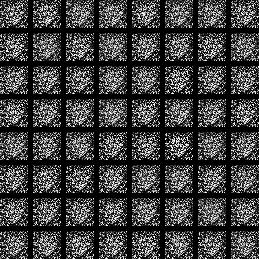
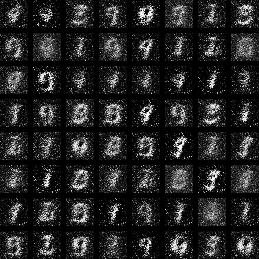
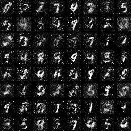

# Example:Use GAN generate handwritten numbers, using full connection.
 The use of fully connected neural network, each epoch generated images stored in the output directory.
 How to generate?
 ```python
 python3 ./handwriting_generated_gan_app.py
 ```
 
 *Name* | *Epoch 1* | *Epoch 15* | *Epoch 30* |
:---: | :---: | :---: | :---: |
 GAN |  |  |  |

 Any questions please contact me，email address:<liufanping@iveely.com>.