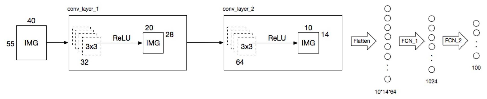

# Example:Face recognition based on image classification
This example based on image classification to identify the face, using convolutional neural network and fully connected neural network.<br/>

#### Network model structure

 
 
#### How to train?
 ```python
 python3 ./face_recognize_app.py --execute train
 ```
 
 #### How to test?
 ```python
 python3 ./face_recognize_app.py --execute test
 ```
 
 #### Example of faces:
 
 *Person Id* | *1* | *2* | *3* | *4* | *5* | *6* | *7* |
:---: | :---: | :---: | :---: | :---: | :---: | :---: | :---: |
 Person A |  |  |  |  |  |  |  |
 Person B |  |  |  |  |  |  |  |
...|...|...|...|...|...|

 Any questions please contact me，email address:<liufanping@iveely.com>.