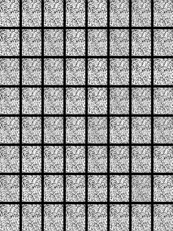
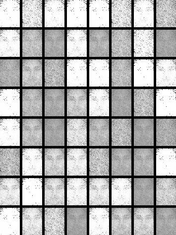

# Example:Simple face generation based on GAN
Using GAN for simple face generation experiments.

#### How to generate?
 ```python
 python3 ./face_generated_gan_app.py
 ```
 You will see an output directory containing the faces generated by different epochs.
 
 #### Examples of generated faces
 
| *Epoch=1* | *Epoch300* | ... |
:---: | :---: | :---: |
 | 
...|...|...|

Although the effect is rather vague, but the effect has been vaguely seen.<br/>

Any questions please contact me，email address:<liufanping@iveely.com>.