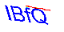

# Example:OCR:Identification code based on CRNN, 
The verification code is identified based on convolutional neural network and recursive neural network.

#### How to get training set?
 ```python
 python3 ./gen_codes.py
 ```
 Ten thousand verification codes will be randomly generated for training

#### How to train?
 ```python
 python3 ./CRNN_app.py --execute train
 ```

#### How to predict?
 ```python
 python3 ./CRNN_app.py --execute predict
 ```

 #### Verification code example
 
| code | Identify the result | 
|:---: | :---: |
 | IBfQ |
 | JNG8 |
 | zuCa |


Recognition accuracy results are still relatively satisfactory

Any questions please contact me，email address:<liufanping@iveely.com>.